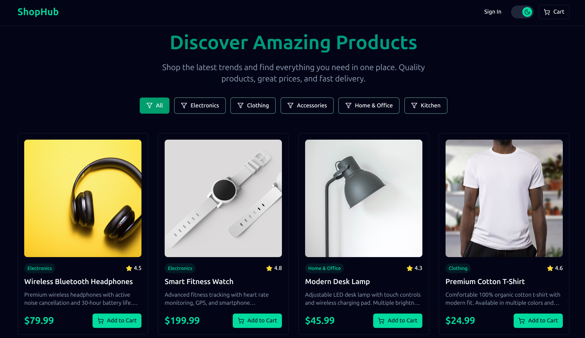

# Shop Hub 🛒 - Qtec Frontend Assessment Project



Welcome to **Shop Hub**, a sleek and modern single-page e-commerce application built for the Qtec Solution Limited Junior Frontend Developer assessment. Crafted with **Vite**, **React**, **TypeScript**, **Tailwind CSS**, and **shadcn-ui**, Shop Hub delivers a responsive, accessible, and user-friendly shopping experience with features like product listings, detailed views, cart management, and a seamless checkout modal.

## 🚀 Live Demo & Repository

- **Live Demo**: [https://shop-hub-eosin.vercel.app/](https://shop-hub-eosin.vercel.app/)  
- **GitHub Repository**: [https://github.com/SIFAT5673/Shop-Hub](https://github.com/SIFAT5673/Shop-Hub)  

 

## ✨ Features

Shop Hub is designed to meet the Qtec assessment requirements while showcasing modern frontend development practices:

- **Product Listings**: Browse a dynamic grid of products with images, names, and prices, powered by mock data.  
- **Detailed Product Views**: Dive into rich product details with descriptions, pricing, and add-to-cart functionality.  
- **Cart Management**: Add, remove, and update items in the cart with real-time total calculations.  
- **Checkout Modal**: A responsive modal triggered by the cart's "Checkout" button, featuring a form with fields for Name, Email, Address, and a Submit button to simulate order placement, as specified in the assessment.  
- **Responsive Design**: Optimized for all devices—desktop, tablet, and mobile—using Tailwind CSS.  
- **Accessibility**: Built with ARIA attributes and keyboard navigation for an inclusive experience.  

## 🛠️ Technologies Used


- **Vite**: Lightning-fast build tool for a streamlined development experience.  
- **React**: Dynamic and reusable UI components for a seamless user interface.  
- **TypeScript**: Type-safe development for robust and maintainable code.  
- **Tailwind CSS**: Utility-first CSS framework for responsive and modern styling.  
- **shadcn-ui**: Customizable UI components for a polished and professional look.  

## 📦 Installation

Get Shop Hub running locally in just a few steps:

1. **Clone the Repository**:
   ```bash
   git clone https://github.com/SIFAT5673/Shop-Hub.git
   ```
2. **Navigate to the Project Directory**:
   ```bash
   cd Shop-Hub
   ```
3. **Install Dependencies**:
   ```bash
   npm install
   ```
4. **Start the Development Server**:
   ```bash
   npm run dev
   ```
5. Open your browser and visit `http://localhost:5173` to explore Shop Hub!

## 🗂️ Project Structure

```plaintext
Shop-Hub/
├── public/                 # Static assets (e.g., images)
├── src/                    # Main source code
│   ├── assets/             # Images and other assets
│   ├── components/         # Reusable React components (e.g., ProductCard, CheckoutModal)
│   ├── pages/              # Page components (e.g., Home, ProductDetail)
│   ├── styles/             # Tailwind CSS configuration and custom styles
│   ├── data/               # Mock product data
│   ├── App.tsx             # Main application component
│   └── main.tsx            # Entry point
├── screenshots/            # Screenshots for documentation
├── README.md               # Project documentation
└── package.json            # Dependencies and scripts
```

## 📸 Screenshots

| **Home Page** | 
|---------------|
|  |
| **Checkout Modal** |
|---------------|-------------------|
 | |

*Note*: Screenshots are available in the `screenshots` folder of the repository.

## 🎯 Assessment Requirements

This project was meticulously crafted to meet the requirements outlined in the Qtec Solution Limited Junior Frontend Developer assessment ([Task Document](https://drive.google.com/file/d/1XJ8fW0S_w4LpwMIXFWPQ6cWvaB2RCdcF/view?usp=drive_link)):

- **Checkout Functionality**: A modal form appears when the "Checkout" button is clicked, featuring fields for Name, Email, Address, and a Submit button to simulate order placement without an API.  
- **Responsive Design**: Fully optimized for all screen sizes using Tailwind CSS.  
- **Modern Tech Stack**: Leverages Vite, React, TypeScript, Tailwind CSS, and shadcn-ui for a performant and scalable application.  
- **Accessibility**: Includes ARIA attributes and keyboard navigation to ensure inclusivity.  
- **Design Focus**: Emphasizes a clean, modern UI with intuitive navigation, aligning with the assessment's design requirements.

## 💡 Challenges & Solutions

- **Challenge**: Building a responsive and accessible checkout modal.  
  **Solution**: Utilized Tailwind CSS for responsive styling and integrated ARIA attributes with shadcn-ui components to ensure accessibility.  
- **Challenge**: Efficiently managing cart state across components.  
  **Solution**: Implemented React Context API for global state management, ensuring real-time updates and a smooth user experience.  
- **Challenge**: Balancing performance and feature-rich functionality.  
  **Solution**: Leveraged Vite’s fast build system and TypeScript’s type safety to optimize development and runtime performance.

## 🌟 Why Shop Hub Stands Out

Shop Hub is more than just an assessment project—it’s a showcase of modern frontend development principles, combining a robust tech stack, user-centric design, and attention to detail. It reflects my passion for creating intuitive, accessible, and visually appealing web applications.

## 📬 Contact

For any questions or feedback, feel free to reach out:  
- **Email**: sifat16@cse.pstu.ac.bd
- **Website**: portfolio-sifatulhuq.vercel.app
- **Qtec Solution Limited Contact**: [info@QtecSolution.com](mailto:info@QtecSolution.com)  
- **Website**: [www.QtecSolution.com](http://www.QtecSolution.com)

Thank you for reviewing my submission! I’m excited about the opportunity to contribute to Qtec Solution Limited as a Junior Frontend Developer.
